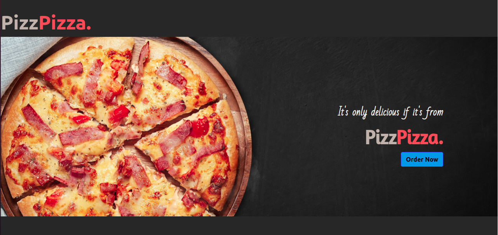
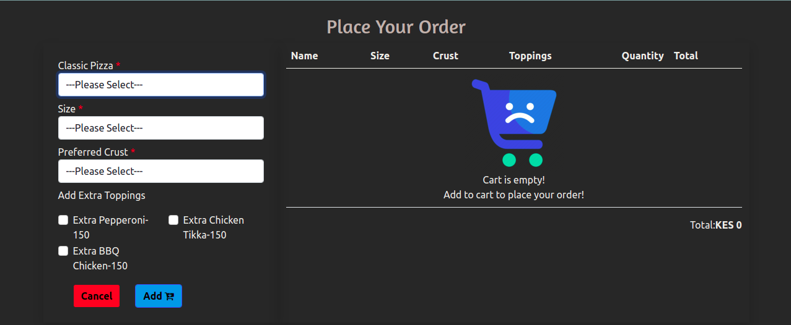
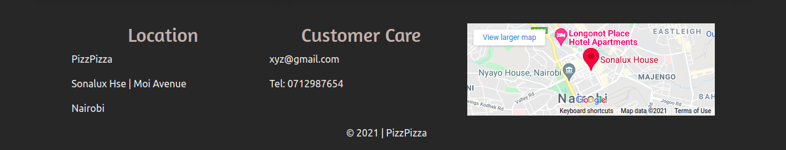
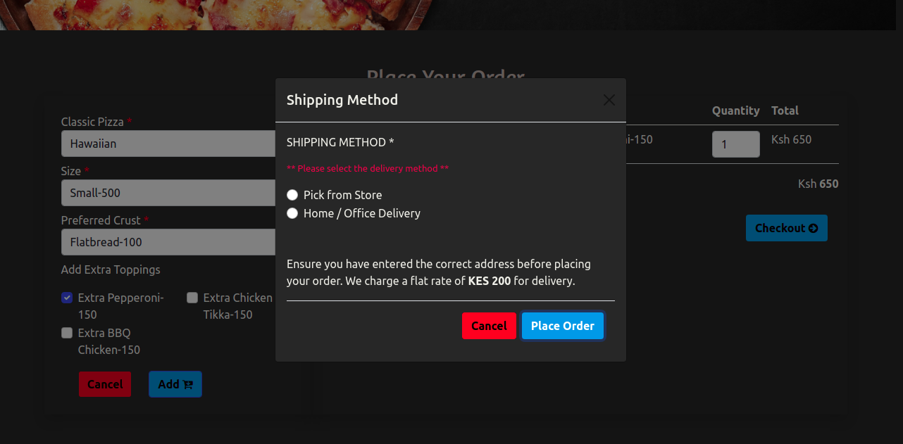
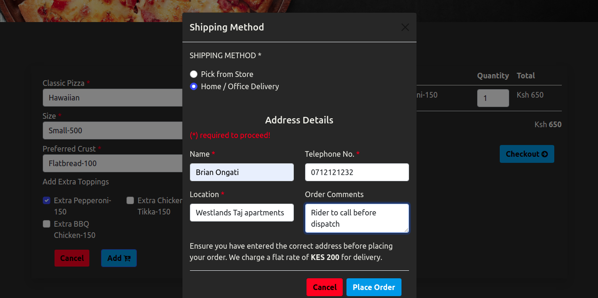
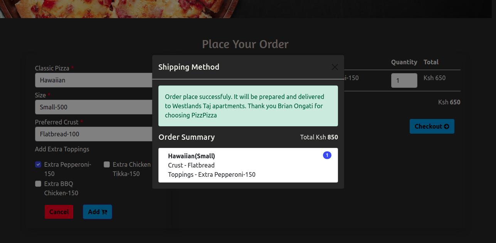

## Table of Contents

- Project Title
- Description
- Deployment
- BDD (Behaviour Driven Development)
- Project Preview
- Technologies used
- Bugs
- Acknowledgement
- Contacts
- Author

#

## DESCRIPTION

- This is a pizza ordering web application for a pizza company known as PizzPizza where their customers can order for pizza.

## Deployment

- You can vist the site directly by clicking [HERE](https://mrbrianomollo.github.io/pizzPizza/)
- You can view the source code on github [HERE](https://github.com/mrbrianomollo/pizzPizza.git)

## BDD

> The website will require the user to select:
i) their prefered pizza, size, crust and toppings
ii) on checkout they will need to select their prefered shipping method
iii) after which they will input their address and place their order 

## Project Screenshot

- This is the landing page with a clickable button that directs you to the order section of the page.

- This is the order section where the you are required to enter your details.

- This is the footer section that contains the contact details and location of the business.

- On clicking the checkout button the user will be prompted to select their delivery option. if they fail to do so they will get an alert that it is mandatory.

- This is where you key in your delivery details.

- Succesfull order placement notification.

## Technologies Used

- html
- css
- javascript
- bootsrap

## Bugs

- You can not clear your selection after order placement
- You can not remove the selected item from the cart unless you refresh

## Acknowledgement

I would like to thank Moringa for giving me this opportunity to get myself equipped with this precious knowledge. 

## Contacts

Incase of any feedback or contribution to fix the bugs you can reach me through my personal contacts:

- mrbrianomollo@gmail.com
- 0723670846

## Author

> **Brian Ongati**
